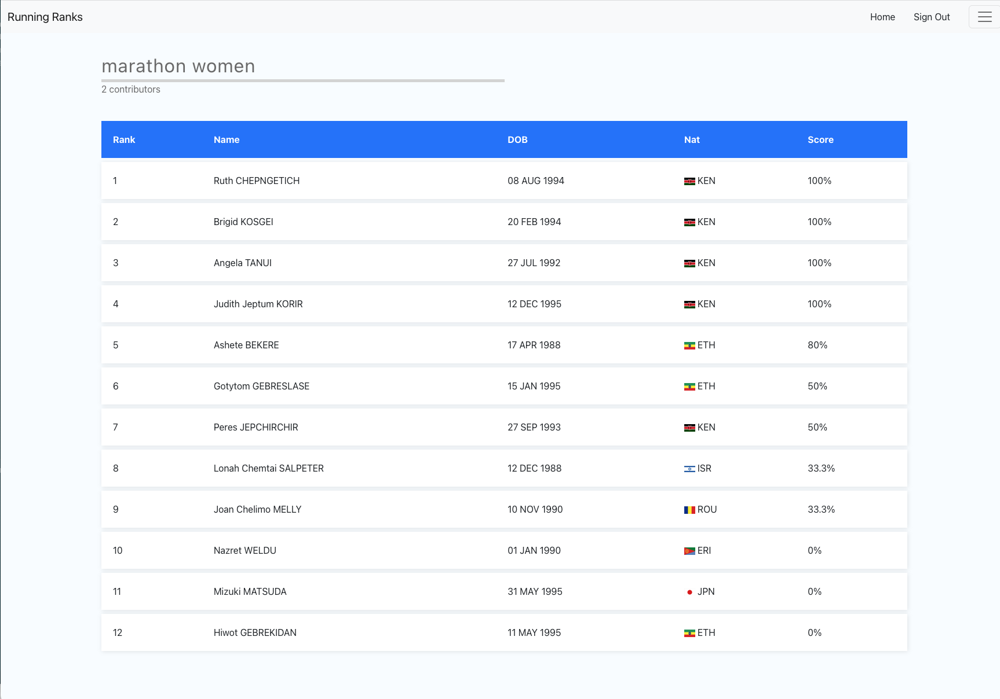

# Crowd Sourced Running Ranks

Compiles crowd sourced running ranks via a React app and a firebase backend. Data about the best athletes in the world is scraped off [worldathletics.org](https://worldathletics.org/) and uploaded to a firebase firestore database. Users are asked to contribute to the database before viewing each event by clicking on the faster of two runners. Firebase functions compile this into athlete vs. athlete averages, then into a score representing the average precent of athletes the crowd believes each athlete can beat. 

Access the site at [runningranks.com](https://www.runningranks.com)

# Pictures of the website

# Access the site at [runningranks.com](https://www.runningranks.com)